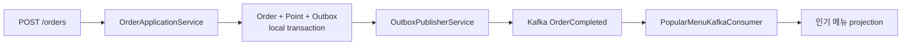
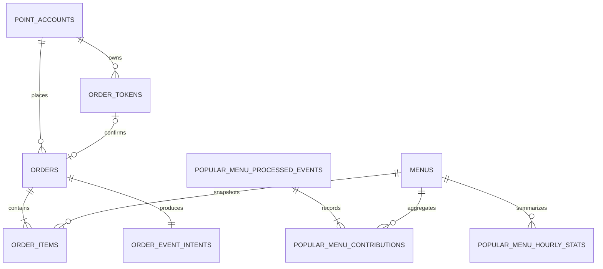

# Coffee Order Service

포인트로 커피를 주문하고, 완료된 주문을 Kafka로 전달해 최근 168시간의 인기 메뉴를 집계하는 Spring Boot 서비스입니다.

단순한 CRUD보다 다중 인스턴스 환경의 동시성, 주문 멱등성, 트랜잭션 경계와 비동기 이벤트 전달의 정합성을 검증하는 데 초점을 맞췄습니다.

## 주요 기능

- 주문 가능한 메뉴와 현재 가격 조회
- 사용자 포인트 충전과 동시성 안전한 차감
- 일회성 주문 토큰을 이용한 중복 주문 방지
- 주문·결제·Outbox 발행 의도의 단일 PostgreSQL transaction 처리
- Kafka를 통한 `OrderCompleted` 이벤트 전달
- `eventId` 기반 Consumer 멱등 처리와 인기 메뉴 projection
- 다중 애플리케이션 인스턴스의 정상 부하·장애 복구·정합성 검증
- Actuator, Prometheus, PostgreSQL과 Kafka 기반 성능 관측

## 기술 구성

| 구분 | 기술 |
|---|---|
| Application | Java 21, Spring Boot 4.1, Spring MVC, JDBC |
| Data | PostgreSQL, Flyway |
| Messaging | Apache Kafka, Spring Kafka |
| Observability | Actuator, Micrometer, Prometheus, `pg_stat_statements` |
| Test | JUnit 5, Testcontainers, k6, Docker Compose, PowerShell |

## 구조

코드는 기술 계층 전체를 한곳에 모으지 않고 `menu`, `point`, `ordertoken`, `order`, `outbox`, `popularmenu`처럼 기능별 package를 먼저 나눕니다. 각 기능 안에서는 역할에 따라 `domain`, `application`, `persistence`, `web`, `kafka`, `observability`로 구분합니다.

```text
src/main/java/io/github/w00lam/coffeeorderservice
├─ menu
├─ point
├─ ordertoken
├─ order
├─ outbox
│  ├─ application
│  ├─ persistence
│  ├─ kafka
│  └─ observability
└─ popularmenu
   ├─ application
   ├─ persistence
   ├─ kafka
   ├─ observability
   └─ web
```

- `Controller`는 HTTP 입력과 응답 변환을 담당합니다.
- `Service`는 업무 흐름과 transaction 경계를 조정합니다.
- `Repository`는 application이 사용하는 저장소 계약을 정의하고 `Jdbc*Repository`가 PostgreSQL 접근을 구현합니다.
- `kafka`는 이벤트 발행과 Consumer 진입점을 담당합니다.
- `observability`는 업무 코드 대신 Micrometer metric을 생성하고 기록합니다.

## 주문 이벤트 흐름



주문, 주문 항목, 포인트 차감, 주문 토큰 결과와 Outbox 발행 의도는 하나의 local transaction에서 함께 확정됩니다. 실제 Kafka 발행은 transaction 밖에서 처리하므로 브로커 장애가 이미 완료된 주문을 되돌리지 않습니다.

여러 publisher는 PostgreSQL의 `FOR UPDATE SKIP LOCKED`로 서로 다른 Outbox 이벤트를 선점합니다. Kafka의 at-least-once 전달로 같은 이벤트가 다시 올 수 있으므로 Consumer는 `eventId` unique constraint와 `ON CONFLICT DO NOTHING`으로 업무 효과를 한 번만 반영합니다.

## 핵심 설계 선택

| 선택 | 해결하려는 문제 | 적용 방식 |
|---|---|---|
| 조건부 SQL과 row lock | 동시 충전의 lost update와 잔액 이하 차감 | PostgreSQL이 원자적으로 갱신하고 결과를 반환 |
| 일회성 주문 토큰 | timeout 재시도와 동시 중복 주문 | 요청 fingerprint와 성공·업무 실패 결과를 토큰에 확정 |
| Transactional Outbox | DB commit과 Kafka 발행 사이의 유실 | 주문 transaction에서 발행 의도를 저장한 뒤 비동기 발행 |
| Kafka | 주문 응답과 후속 업무 분리, 피크 유입 완충, 독립 확장·재처리 | Consumer Group별 Offset과 장애 경계를 분리 |
| Consumer 처리 이력 | at-least-once 중복 전달 | `eventId` 고유 제약과 projection 반영을 같은 transaction에서 처리 |
| 영속 projection | 매 조회 시 전체 주문 집계 비용 | 완료 이벤트를 시간 단위 통계로 누적하고 정확한 168시간 구간 조회 |

Kafka에는 현재 `OrderCompleted` 한 종류만 발행합니다. Transactional Outbox Publisher가 `orderId`를 key로 사용하며, 후속 업무는 서로 다른 Consumer Group으로 분리하는 것이 설계 원칙입니다.

| Consumer | 소비 후 책임 | 현재 상태 |
|---|---|---|
| 인기 메뉴 집계 Consumer | 처리 이력과 PostgreSQL projection을 원자적으로 갱신 | 구현됨 |
| 데이터 수집 플랫폼 전달 Consumer | 사용자, 주문 항목과 결제금액을 HTTP 플랫폼에 전달 | 구현됨 (`eventId`를 `Idempotency-Key`로 전달) |

각 Consumer Group은 별도의 Retry Topic과 DLT 경계를 가지며, 한 Consumer의 장애가 주문 성공이나 다른 Consumer를 막지 않도록 설계합니다. 파티션 수와 Consumer 인스턴스 수는 임의로 고정하지 않고 목표 처리량, 단일 Consumer 처리량과 허용 lag를 측정한 뒤 결정합니다. 자세한 대안과 trade-off는 [주문 이벤트 전달 결정](docs/decisions/order-event-delivery.md)에 기록했습니다.

## API

| 기능 | Method | Endpoint | 인증 사용자 |
|---|---|---|---|
| 메뉴 목록 조회 | `GET` | `/menus` | 불필요 |
| 포인트 충전 | `POST` | `/point-charges` | 필요 |
| 주문 토큰 발급 | `POST` | `/order-tokens` | 필요 |
| 주문 및 포인트 결제 | `POST` | `/orders` | 필요 |
| 인기 메뉴 조회 | `GET` | `/popular-menus` | 불필요 |

`POST /orders`는 서버가 발급한 토큰을 `Order-Token` header로 받습니다. 인증 사용자 제공 방식, 요청·응답 예시와 오류 계약은 [API 상세 명세](docs/Specification.md)를 기준으로 합니다.

실제 인증 시스템이 없는 로컬 평가에서는 `local` profile을 활성화하고 `X-User-Id` header로 사용자를 지정할 수 있습니다. 이 방식은 개발·과제 검증 전용이며 운영 인증을 대체하지 않습니다.

```powershell
.\gradlew.bat bootRun --args='--spring.profiles.active=local'
```

데이터 수집 전달은 `coffee.data-collection.enabled=true`, `coffee.data-collection.base-url=<Mock API URL>`로 활성화합니다. 전용 Consumer Group과 Retry Topic·DLT를 사용하므로 외부 플랫폼 장애가 주문 완료와 인기 메뉴 집계를 막지 않습니다.

## 데이터 모델



- `orders`와 `order_items`는 완료 주문과 주문 시점의 메뉴 단가를 보존합니다.
- `order_event_intents`는 주문과 원자적으로 저장되는 Outbox입니다.
- `popular_menu_processed_events`는 Consumer 중복 처리를 차단합니다.
- `popular_menu_contributions`와 `popular_menu_hourly_stats`는 인기 메뉴 조회의 영속 projection입니다.

전체 column, constraint와 상태 모델은 [API 상세 명세의 Data Model](docs/Specification.md#data-model)을 참고하세요.

## 실행과 검증

### 단위·통합 테스트

Windows:

```powershell
.\gradlew.bat test
```

macOS/Linux:

```bash
./gradlew test
```

통합 테스트는 Testcontainers를 사용하므로 Docker가 필요합니다.

### 로컬 다중 인스턴스 검증

재현 가능한 전체 실행에는 Java 21, Docker Compose, PowerShell과 k6가 필요합니다. 다음 명령은 PostgreSQL·Kafka와 애플리케이션 3개를 시작하고 정상 부하, 장애 복구와 11개 정합성 불변식을 검증합니다.

```powershell
powershell -ExecutionPolicy Bypass -File .\system-test\scripts\start-environment.ps1
powershell -ExecutionPolicy Bypass -File .\system-test\load\run-normal-load.ps1
powershell -ExecutionPolicy Bypass -File .\system-test\fault\run-fault-injection.ps1
powershell -ExecutionPolicy Bypass -File .\system-test\scripts\stop-environment.ps1
```

실행 결과는 `build/system-test/results`에 저장됩니다. 실행별 k6 원본, 불변식 결과, Prometheus metric, PostgreSQL query 통계, slow query log와 SHA-256 manifest가 포함됩니다. 환경변수와 성능 반복 측정 방법은 [system-test 실행 안내](system-test/README.md)를 참고하세요.

## 관측과 성능 최적화

Actuator와 Prometheus endpoint는 `observability` Spring profile에서만 활성화됩니다. Outbox와 Consumer metric은 기능별 `*Metrics` component에서 기록하며 metric 이름은 `CoffeeMetricNames`에서 관리합니다.

고부하 반복 측정에서 Outbox batch 사이의 `200ms` fixed delay가 주 병목으로 확인됐습니다. 다른 변수를 유지하고 poll interval을 `20ms`로 줄인 결과, high profile 5회 중앙값 기준 publication p95는 `3318.17ms`에서 `2135.31ms`로 35.65% 감소했습니다. baseline 15회와 optimized 15회 모두 기능 실패와 예상하지 않은 5xx가 0건이었고 11개 불변식과 최종 drain을 유지했습니다.

이 수치는 로컬 단일 PostgreSQL, Kafka broker 1개와 topic partition 1개 환경의 비교 결과이며 운영 SLO나 최종 capacity가 아닙니다. 측정 조건과 원본 hash는 [성능 측정 보고서](docs/performance-test-report-2026-07-18.md)에 기록했습니다.

## 문서

- [요구사항](docs/Requirements.md)
- [기술 의사결정](docs/decisions/README.md)
- [도메인 설계](docs/Domain.md)
- [API·데이터 모델·흐름 상세 명세](docs/Specification.md)
- [다중 인스턴스 시스템 검증 보고서](docs/system-test-report.md)
- [성능 측정 및 최적화 보고서](docs/performance-test-report-2026-07-18.md)
- [프로젝트 Wiki](https://github.com/w00lam/coffee-order-service/wiki)
