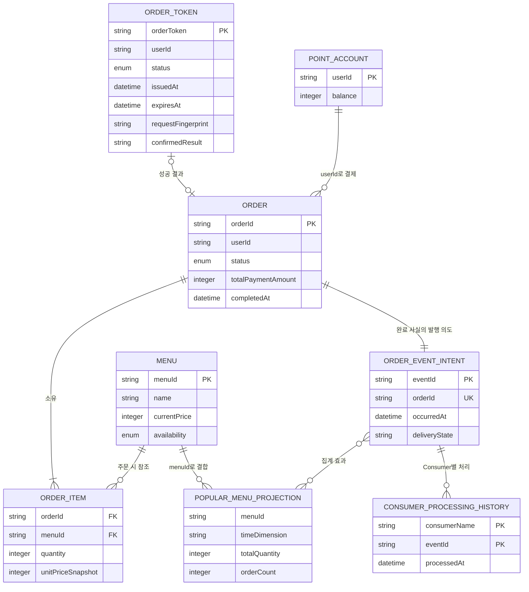
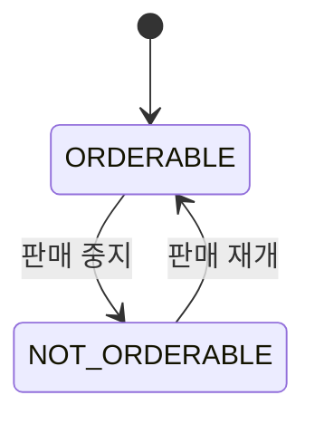
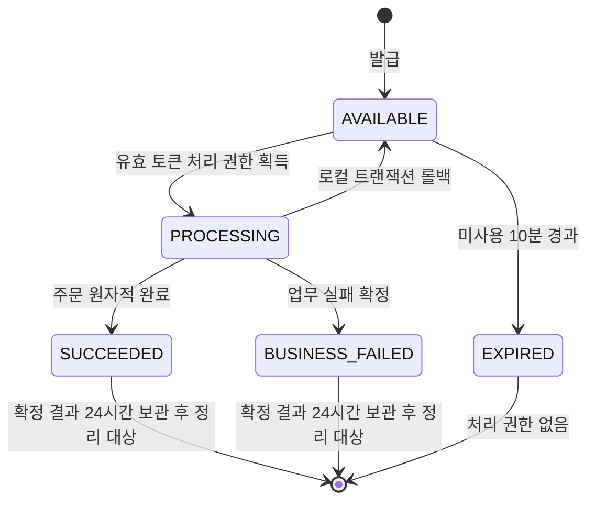
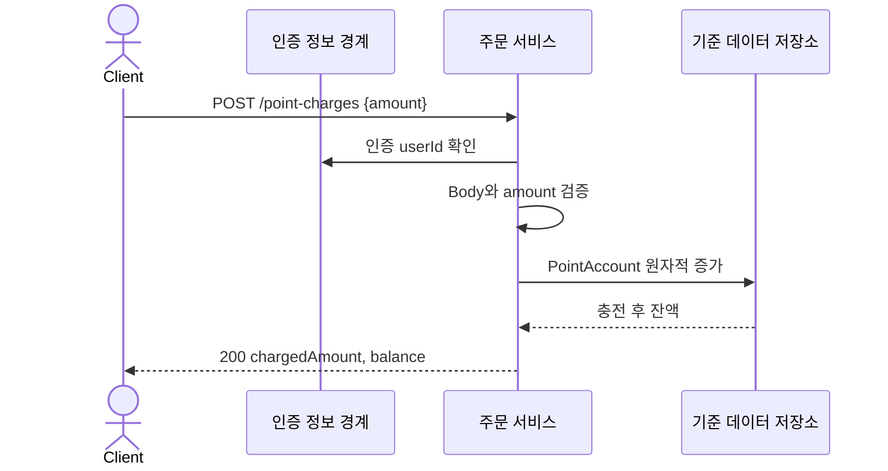
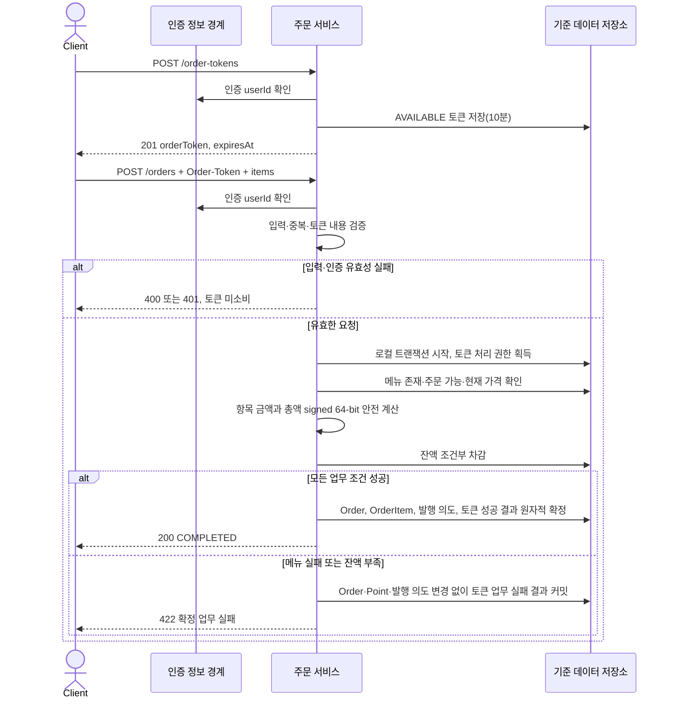
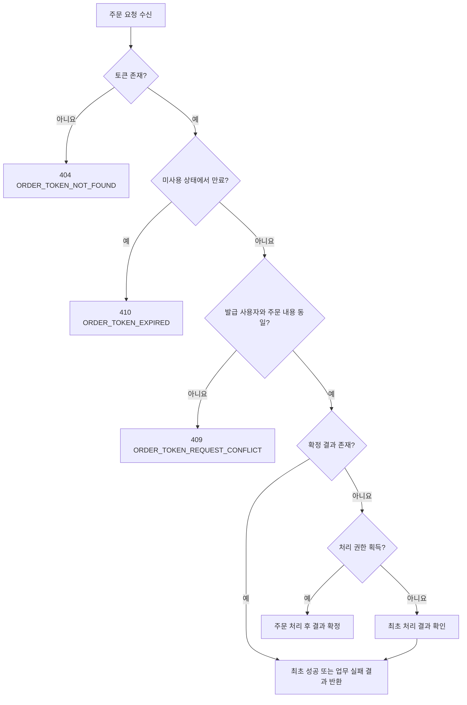
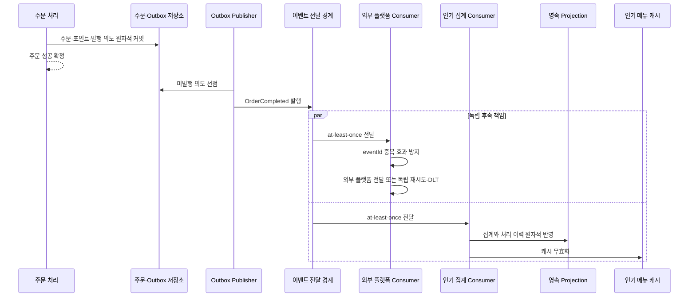
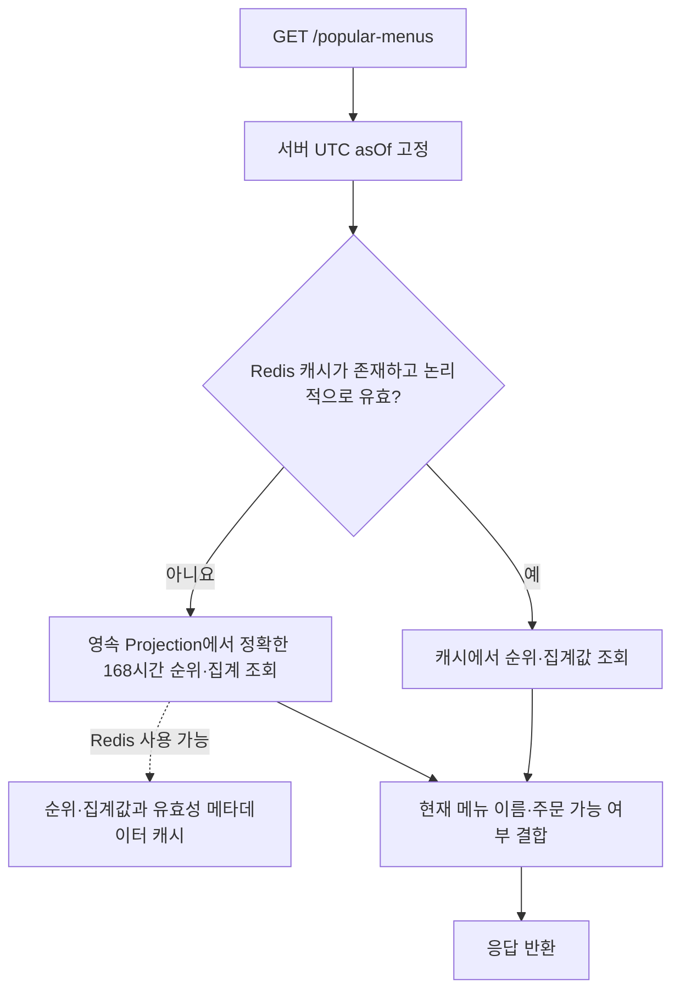

# API Specification

## Overview

### Purpose

확정된 요구사항, Accepted Decision과 도메인 모델을 구현 및 테스트 가능한 API, 데이터, 상태, 검증과 상호작용 계약으로 구체화합니다.

### Scope

- 메뉴 목록 조회, 포인트 충전, 일회성 주문 토큰 발급, 주문 및 포인트 결제, 인기 메뉴 조회 API
- 주문 완료 이벤트와 외부 데이터 수집 플랫폼 전달 및 인기 메뉴 집계의 논리 계약
- 영속 데이터 모델, 논리 ERD, 상태와 원자적 처리 경계
- 정상·업무 실패·유효성 실패 흐름 및 비동기 장애 격리
- 구현 전에 추가 근거가 필요한 Open / Downstream 사항의 분리

구현 클래스, 패키지, SQL 문법, 인덱스 문법, 실제 이벤트 타입명·Topic명·직렬화 형식·스키마 버전과 Redis Key는 이 문서의 범위가 아닙니다.

### Dependencies

- 인증 정보 제공 경계: 포인트 충전, 주문 토큰 발급과 주문에서 신뢰할 수 있는 `userId`를 제공합니다. 제공 주체, 토큰 형식, 필수 Claim과 검증 방식은 Open입니다.
- PostgreSQL: 주문·포인트·이벤트 발행 의도와 인기 메뉴 영속 Projection의 기준 데이터를 보존합니다.
- Kafka: `OrderCompleted`를 `at-least-once`로 전달합니다.
- Redis: 인기 메뉴 조회 캐시와 정기 Refresh 조정에 사용되는 파생 저장소입니다.
- 데이터 수집 플랫폼: 완료 주문 내역을 전달받습니다. 실제 인터페이스와 장애 계약은 Open이며 Mock API 또는 테스트 코드로 대체할 수 있습니다.

### 공통 표현과 경계

- 충전금액, 포인트 잔액, 메뉴 가격, 주문 항목 수량, 주문 항목 금액과 주문 총액은 JSON 정수로 표현하며 외부 계약의 기술적 범위는 signed 64-bit입니다. 금액·포인트는 `0` 이상 `9,223,372,036,854,775,807` 이하, 충전금액·주문 항목 수량은 `1` 이상 같은 최댓값 이하입니다.
- 항목 금액의 곱셈, 총액의 합산과 잔액의 증가·감소는 모든 중간 결과까지 signed 64-bit 범위를 만족해야 합니다. 범위를 넘으면 반올림·절삭·순환시키지 않고 해당 API의 범위 초과 오류로 거부합니다.
- 인기 메뉴의 누적 `totalQuantity`와 `orderCount`는 여러 완료 주문의 합이므로 주문 한 건의 signed 64-bit 입력 범위를 집계 상한으로 사용하지 않습니다. 두 값은 0 이상의 임의 정밀도 JSON 정수로 정확하게 표현하며 overflow로 포화·순환시키지 않습니다.
- 모든 저장·이벤트 시각과 API 시각은 UTC ISO 8601 문자열로 표현합니다. 인기 메뉴 업무 기준 시간대는 `Asia/Seoul`입니다.
- `userId`는 인증 정보에서만 얻습니다. 포인트 충전, 주문 토큰 발급과 주문 요청 Body에 `userId`가 있으면 `400 INVALID_REQUEST`로 거부합니다.
- 업무상 식별자는 문자열로 표현하며 빈 문자열은 허용하지 않습니다. 구체적인 생성 형식은 구현 책임입니다. `menuId` 오름차순은 대소문자나 문자를 변환하지 않은 식별자 문자열의 Unicode code point 순서입니다.
- Content-Type을 사용하는 요청과 응답은 JSON입니다.

### 응답과 오류 계약

성공 응답은 각 API에 정의된 JSON을 직접 반환합니다. 실패 응답은 다음 형식을 공통으로 사용합니다.

```json
{
  "code": "MENU_NOT_ORDERABLE",
  "message": "주문할 수 없는 메뉴가 포함되어 있습니다.",
  "details": [
    {
      "field": "items[0].menuId",
      "reason": "주문 불가 상태입니다."
    }
  ],
  "occurredAt": "2026-07-16T03:00:00Z"
}
```

| 필드 | 필수 | 의미 |
| --- | --- | --- |
| `code` | 필수 | 클라이언트가 분기할 수 있는 안정적인 오류 코드 |
| `message` | 필수 | 사람이 이해할 수 있는 오류 설명 |
| `details` | 필수 | 필드별 상세 목록. 상세가 없으면 빈 목록 |
| `details[].field` | 조건부 필수 | 문제가 발생한 요청 필드 경로 |
| `details[].reason` | 필수 | 해당 오류의 구체적 이유 |
| `occurredAt` | 필수 | 최초 결과가 확정되거나 오류가 발생한 UTC 시각 |

오류 범주는 다음과 같이 구분합니다.

- **유효성 실패:** JSON 형식, 필수 필드, 자료형, 정수·범위, 중복 메뉴 ID처럼 업무 처리를 시작하기 전에 판단할 수 있는 오류입니다. `400`을 사용하며 주문 토큰을 소비하지 않습니다.
- **인증 실패:** 신뢰할 수 있는 인증 사용자 정보를 얻지 못한 경우입니다. `401`을 사용하며 주문 토큰을 소비하지 않습니다.
- **업무 실패:** 유효한 요청이 현재 업무 상태 때문에 완료될 수 없는 경우입니다. API별 `404`, `409`, `410` 또는 `422`를 사용합니다. 주문 처리 권한을 얻은 뒤 확인된 메뉴·잔액·계산 실패는 토큰의 `업무 실패 확정` 결과로 보존합니다.
- **운영 보호 거부:** API 요청 크기 제한을 초과하면 `413 REQUEST_TOO_LARGE`를 반환합니다. 구체적인 제한 수치는 Open이며 도메인 상한으로 해석하지 않습니다.
- 명세되지 않은 내부·인프라 실패는 `500 INTERNAL_ERROR` 또는 일시적 가용성 실패인 `503 SERVICE_UNAVAILABLE`로 반환하며, 업무 실패로 확정하거나 성공으로 가장하지 않습니다.

---

## API List

| 기능 | Method | Endpoint | 인증 사용자 | 성공 상태 |
| --- | --- | --- | --- | --- |
| 메뉴 목록 조회 | `GET` | `/menus` | 사용하지 않음 | `200` |
| 포인트 충전 | `POST` | `/point-charges` | 필수 | `200` |
| 일회성 주문 토큰 발급 | `POST` | `/order-tokens` | 필수 | `201` |
| 주문 및 포인트 결제 | `POST` | `/orders` | 필수 | `200` |
| 인기 메뉴 조회 | `GET` | `/popular-menus` | 사용하지 않음 | `200` |

메뉴와 인기 메뉴 조회는 사용자 식별값을 사용하지 않습니다. 배포 경계의 접근 제어 여부는 이 업무 API 계약과 별개입니다.

---

## API

### 메뉴 목록 조회

#### Endpoint

`GET /menus`

#### Description

현재 주문 가능한 메뉴 목록을 반환합니다. 주문 불가 메뉴는 물리적으로 삭제하지 않지만 이 목록에서는 제외합니다.

#### Authentication

업무상 인증 사용자 식별값을 사용하지 않습니다.

#### Path Parameters / Query Parameters / Request Body

없습니다.

#### Response Body

```json
{
  "menus": [
    {
      "menuId": "menu-1",
      "name": "아메리카노",
      "price": 4500
    }
  ]
}
```

| 필드 | 필수 | 의미와 제약 |
| --- | --- | --- |
| `menus` | 필수 | 현재 주문 가능한 메뉴 목록. 해당 메뉴가 없으면 빈 목록 |
| `menus[].menuId` | 필수 | 메뉴 식별값 |
| `menus[].name` | 필수 | 현재 메뉴 이름. 빈 문자열 불가 |
| `menus[].price` | 필수 | 서버가 관리하는 현재 가격. 0 이상 signed 64-bit 최댓값 이하의 정수 |

#### Business Rules / Validation

- 목록 포함 여부와 반환 가격은 메뉴의 현재 주문 가능 상태와 현재 가격을 기준으로 합니다.
- 이 조회 결과의 가격은 견적 또는 예약 가격이 아닙니다. 주문 총액은 주문 처리 시점에 서버가 다시 계산합니다.
- 목록 순서는 보장하지 않습니다. 클라이언트와 테스트는 반환 순서에 의미를 부여하지 않아야 합니다.

#### Error Cases

공통 `500`, `503` 오류만 적용합니다.

---

### 포인트 충전

#### Endpoint

`POST /point-charges`

#### Description

인증된 사용자의 포인트를 원자적으로 증가시킵니다.

#### Authentication

필수입니다. `userId`는 인증 정보에서 추출하며 Body에서 받지 않습니다.

#### Path Parameters / Query Parameters

없습니다.

#### Request Body

```json
{
  "amount": 10000
}
```

| 필드 | 필수 | 의미와 제약 |
| --- | --- | --- |
| `amount` | 필수 | 충전할 원화 금액이자 포인트. 1 이상 signed 64-bit 최댓값 이하의 정수이며 이 기술적 범위와 별개인 업무상 최대는 없음 |

#### Response Body

```json
{
  "chargedAmount": 10000,
  "balance": 25000,
  "chargedAt": "2026-07-16T03:00:00Z"
}
```

| 필드 | 필수 | 의미 |
| --- | --- | --- |
| `chargedAmount` | 필수 | 실제 충전된 포인트 |
| `balance` | 필수 | 충전 완료 뒤의 포인트 잔액 |
| `chargedAt` | 필수 | 충전이 확정된 UTC 시각 |

#### Business Rules

- `amount`만큼 `1원 = 1P`로 충전합니다.
- 현재 잔액을 읽어 덮어쓰지 않고 원자적으로 증가시킵니다.
- 포인트는 만료되지 않고 사용자 간 양도할 수 없습니다.
- 충전과 차감이 동시에 실행되면 먼저 반영된 연산을 기준으로 다음 연산의 성공 여부를 판단합니다.
- 이 API는 멱등 요청 계약을 제공하지 않습니다. 서버가 성공적으로 수락한 각 `POST`는 별도의 충전이며, 같은 `amount`를 다시 보내 성공하면 다시 충전됩니다.

#### Error Cases

| 상태 | 코드 | 범주 | 조건 |
| --- | --- | --- | --- |
| `400` | `INVALID_REQUEST` | 유효성 | Body 누락·형식 오류, `userId` 포함 |
| `400` | `INVALID_CHARGE_AMOUNT` | 유효성 | `amount`가 정수가 아니거나 1 미만 또는 표현 범위 밖 |
| `401` | `UNAUTHENTICATED` | 인증 | 신뢰할 수 있는 인증 사용자 정보 없음 |
| `404` | `USER_NOT_FOUND` | 업무 | 인증 식별값에 해당하는 유효한 사용자가 없음 |
| `422` | `POINT_BALANCE_OUT_OF_RANGE` | 업무 | 충전 후 잔액이 signed 64-bit 최댓값을 초과 |

#### Validation

유효성·인증·사용자 확인이 모두 성공한 뒤 한 번의 원자적 증가로 처리합니다. 실패 시 잔액은 변경되지 않습니다.

---

### 일회성 주문 토큰 발급

#### Endpoint

`POST /order-tokens`

#### Description

인증된 사용자의 주문 시도 하나에 사용할 일회성 토큰을 발급합니다.

#### Authentication

필수입니다. 발급 사용자와 주문 사용자는 같아야 하며 `userId`를 Body에서 받지 않습니다.

#### Path Parameters / Query Parameters

없습니다.

#### Request Body

Body를 사용하지 않습니다.

#### Response Body

```json
{
  "orderToken": "opaque-token-value",
  "issuedAt": "2026-07-16T03:00:00Z",
  "expiresAt": "2026-07-16T03:10:00Z"
}
```

| 필드 | 필수 | 의미 |
| --- | --- | --- |
| `orderToken` | 필수 | 서버가 발급한 불투명한 일회성 주문 토큰 |
| `issuedAt` | 필수 | 발급 UTC 시각 |
| `expiresAt` | 필수 | 사용하지 않은 토큰의 만료 UTC 시각. `issuedAt`부터 10분 |

#### Business Rules / Validation

- 토큰 하나는 발급 사용자 주문 시도 하나에만 대응합니다.
- 사용 전 유효기간은 10분입니다.
- 성공 또는 업무 실패가 확정되면 그 결과를 확정 시점부터 24시간 보관합니다.
- 토큰 정리 주기와 24시간 이후의 장기 감사 보관은 Open입니다.

#### Error Cases

| 상태 | 코드 | 범주 | 조건 |
| --- | --- | --- | --- |
| `400` | `INVALID_REQUEST` | 유효성 | Body에 `userId` 또는 허용되지 않은 입력이 있음 |
| `401` | `UNAUTHENTICATED` | 인증 | 신뢰할 수 있는 인증 사용자 정보 없음 |
| `404` | `USER_NOT_FOUND` | 업무 | 인증 식별값에 해당하는 유효한 사용자가 없음 |

---

### 주문 및 포인트 결제

#### Endpoint

`POST /orders`

#### Description

일회성 주문 토큰으로 처리 권한을 획득하고, 서버 가격으로 주문을 계산하여 포인트로 결제합니다.

#### Authentication

필수입니다. `userId`는 인증 정보에서 추출하며 Body에서 받지 않습니다. 토큰 발급 사용자와 일치해야 합니다.

#### Request Headers

| Header | 필수 | 의미와 제약 |
| --- | --- | --- |
| `Order-Token` | 필수 | `/order-tokens`에서 발급받은 토큰. 빈 문자열 불가 |

#### Path Parameters / Query Parameters

없습니다.

#### Request Body

```json
{
  "items": [
    {
      "menuId": "menu-1",
      "quantity": 2
    },
    {
      "menuId": "menu-2",
      "quantity": 1
    }
  ]
}
```

| 필드 | 필수 | 의미와 제약 |
| --- | --- | --- |
| `items` | 필수 | 하나 이상의 주문 항목. 업무상 최대 개수 없음 |
| `items[].menuId` | 필수 | 주문할 메뉴 식별값. 같은 요청에서 중복 불가 |
| `items[].quantity` | 필수 | 1 이상 signed 64-bit 최댓값 이하의 정수. 이 기술적 범위와 별개인 업무상 최대 없음 |

`userId`, 메뉴 가격, 항목 금액과 총 결제금액은 요청에서 받지 않습니다. 포함되면 유효성 실패로 거부합니다.

#### Response Body

```json
{
  "orderId": "order-1",
  "status": "COMPLETED",
  "items": [
    {
      "menuId": "menu-1",
      "quantity": 2,
      "unitPrice": 4500,
      "lineAmount": 9000
    }
  ],
  "totalPaymentAmount": 9000,
  "remainingPointBalance": 16000,
  "completedAt": "2026-07-16T03:00:00Z"
}
```

| 필드 | 필수 | 의미와 제약 |
| --- | --- | --- |
| `orderId` | 필수 | 완료 주문 식별값 |
| `status` | 필수 | 현재 범위에서는 항상 `COMPLETED` |
| `items` | 필수 | 하나 이상의 확정 주문 항목 |
| `items[].menuId` | 필수 | 메뉴 식별값 |
| `items[].quantity` | 필수 | 확정 수량 |
| `items[].unitPrice` | 필수 | 주문 시점의 서버 가격 스냅샷 |
| `items[].lineAmount` | 필수 | `unitPrice × quantity` |
| `totalPaymentAmount` | 필수 | 모든 `lineAmount`의 합 |
| `remainingPointBalance` | 필수 | 결제 직후 포인트 잔액 |
| `completedAt` | 필수 | 주문과 결제가 확정된 UTC 시각 |

최초 성공과 동일 토큰·동일 주문 내용의 성공 재시도는 모두 `200`과 최초 확정된 동일 응답 Body를 반환합니다.

#### Business Rules

- 요청 항목 순서와 무관하게 `(menuId, quantity)` 집합이 같으면 동일 주문 내용입니다. 동일 메뉴 ID 중복 요청은 정규화하거나 합산하지 않고 거부합니다.
- 동일 토큰의 동시 요청 중 하나만 처리 권한을 얻습니다. 나머지는 승자의 확정 결과를 조회하여 같은 성공 또는 업무 실패를 반환하고 중복 주문·차감을 만들지 않습니다.
- 동일 토큰·다른 주문 내용 또는 발급 사용자와 다른 인증 사용자의 사용은 충돌로 거부합니다.
- 메뉴 하나라도 미존재 또는 주문 불가이면 전체 주문을 실패시킵니다.
- 서버가 처리 시점의 현재 가격으로 항목 금액과 총액을 계산하고 `unitPrice`를 스냅샷으로 보존합니다.
- 포인트 잔액이 총액 이상일 때만 조건부로 차감하며 음수 잔액을 허용하지 않습니다.
- 처리 권한, 포인트 차감, Order·OrderItem, 이벤트 발행 의도와 토큰 성공 결과를 하나의 로컬 트랜잭션에서 확정합니다.
- 메뉴 또는 잔액 업무 실패에서는 Order, OrderItem, 포인트 차감과 이벤트 발행 의도가 남지 않으며 토큰의 실패 결과만 확정합니다.
- 처리 권한을 `PROCESSING`으로 바꾸는 작업은 메뉴·금액·잔액 검증, 주문 변경과 최종 토큰 결과를 포함하는 같은 로컬 트랜잭션 안에서 수행합니다. 프로세스 종료나 DB 오류로 트랜잭션이 롤백되면 `PROCESSING`도 커밋되지 않아 토큰은 다시 `AVAILABLE`로 관찰되며, 그 시점에 10분이 지났다면 다음 시도에서 만료로 판정합니다.
- 동일 토큰의 다른 동시 요청은 해당 트랜잭션의 완료 후 확정 결과를 읽습니다. 최초 트랜잭션이 롤백되면 후속 요청 중 하나가 다시 처리 권한을 획득할 수 있습니다.
- 주문 취소, 결제 취소와 환불은 지원하지 않습니다.

#### Error Cases

| 상태 | 코드 | 범주 | 토큰 결과 확정 | 조건 |
| --- | --- | --- | --- | --- |
| `400` | `INVALID_REQUEST` | 유효성 | 아니요 | Body·Header 형식 오류, 금지 필드 포함 |
| `400` | `EMPTY_ORDER_ITEMS` | 유효성 | 아니요 | `items`가 없거나 빈 목록 |
| `400` | `INVALID_QUANTITY` | 유효성 | 아니요 | 수량이 1 미만, 비정수 또는 signed 64-bit 범위 밖 |
| `400` | `DUPLICATE_MENU_ID` | 유효성 | 아니요 | 동일 `menuId`가 둘 이상의 항목에 존재 |
| `401` | `UNAUTHENTICATED` | 인증 | 아니요 | 신뢰할 수 있는 인증 사용자 정보 없음 |
| `404` | `USER_NOT_FOUND` | 업무 | 아니요 | 인증 식별값에 해당하는 유효한 사용자가 없음 |
| `404` | `ORDER_TOKEN_NOT_FOUND` | 업무 | 아니요 | 발급 또는 보관된 사실이 없는 토큰 |
| `409` | `ORDER_TOKEN_REQUEST_CONFLICT` | 업무 | 아니요 | 같은 토큰에 다른 주문 내용 또는 다른 사용자 |
| `410` | `ORDER_TOKEN_EXPIRED` | 업무 | 아니요 | 사용되지 않은 채 10분이 지난 토큰 |
| `422` | `MENU_NOT_FOUND` | 업무 | 예 | 요청 메뉴 하나 이상이 존재하지 않음 |
| `422` | `MENU_NOT_ORDERABLE` | 업무 | 예 | 요청 메뉴 하나 이상이 주문 불가 상태 |
| `422` | `ORDER_AMOUNT_OUT_OF_RANGE` | 업무 | 예 | 항목 곱셈, 총액 합산 또는 중간 결과가 signed 64-bit 범위를 초과 |
| `422` | `INSUFFICIENT_POINTS` | 업무 | 예 | 포인트 잔액이 총 결제금액보다 적음 |

업무 실패가 확정된 토큰의 동일 주문 재시도는 최초 실패와 같은 HTTP 상태, 오류 코드와 최초 `occurredAt`을 포함한 동일 응답 Body를 반환합니다. 만료와 미존재는 서로 다른 상태와 코드로 구분합니다.

#### Validation

검증 순서는 다음 관찰 가능한 경계를 따릅니다.

1. JSON·필수 필드·자료형·금지 필드·빈 목록·수량·중복 메뉴 ID를 검증합니다.
2. 인증 사용자와 사용자 유효성을 확인합니다.
3. 토큰의 미존재·만료·소유자와 주문 내용 동일성을 확인하고 처리 권한을 획득합니다.
4. 모든 메뉴의 존재·주문 가능 여부와 signed 64-bit 금액 계산 범위를 검증합니다.
5. 포인트를 조건부 차감하고 주문, 발행 의도와 토큰 성공 결과를 원자적으로 확정합니다.

---

### 인기 메뉴 조회

#### Endpoint

`GET /popular-menus`

#### Description

조회 기준 시점부터 정확히 168시간 전까지 결제 완료된 주문의 인기 메뉴를 최대 3개 반환합니다.

#### Authentication

업무상 인증 사용자 식별값을 사용하지 않습니다.

#### Path Parameters / Query Parameters / Request Body

없습니다. 조회 기준 시각은 서버가 요청 처리 중 한 번 고정합니다.

#### Response Body

```json
{
  "asOf": "2026-07-16T03:00:00Z",
  "windowStart": "2026-07-09T03:00:00Z",
  "businessTimeZone": "Asia/Seoul",
  "menus": [
    {
      "rank": 1,
      "menuId": "menu-1",
      "name": "아메리카노",
      "orderable": false,
      "totalQuantity": 120,
      "orderCount": 85
    }
  ]
}
```

| 필드 | 필수 | 의미와 제약 |
| --- | --- | --- |
| `asOf` | 필수 | 조회 계산에 고정한 UTC 시각 |
| `windowStart` | 필수 | `asOf`에서 정확히 168시간 전인 UTC 시각 |
| `businessTimeZone` | 필수 | 항상 `Asia/Seoul` |
| `menus` | 필수 | 0개 이상 3개 이하의 순위 결과 |
| `menus[].rank` | 필수 | 1부터 시작하는 결과 순위 |
| `menus[].menuId` | 필수 | 집계 메뉴 식별값 |
| `menus[].name` | 필수 | 현재 메뉴 이름 |
| `menus[].orderable` | 필수 | 응답 시점의 현재 주문 가능 여부. 과거 판매 집계 포함 여부와 무관 |
| `menus[].totalQuantity` | 필수 | 구간 내 총 판매 수량. 0 이상의 임의 정밀도 JSON 정수 |
| `menus[].orderCount` | 필수 | 구간 내 해당 메뉴가 포함된 완료 주문 건수. 0 이상의 임의 정밀도 JSON 정수 |

#### Business Rules

- 집계 구간은 `windowStart < completedAt <= asOf`인 UTC 절대 시각의 이동 구간입니다. `Asia/Seoul`은 업무 기준 시간대이며 달력 날짜로 구간을 자르지 않습니다.
- 결제까지 완료되어 `OrderCompleted`가 발생한 주문만 집계합니다.
- 현재 `orderable=false`인 메뉴도 구간 내 판매 기록이 있으면 포함합니다.
- 한 완료 주문에서 한 메뉴는 `orderCount`에 한 번 기여하고 수량 전체가 `totalQuantity`에 기여합니다.
- `totalQuantity` 내림차순, `orderCount` 내림차순, `menuId` 오름차순으로 정렬합니다.
- 최대 3개를 반환하고 3개 미만이면 실제 결과만, 결과가 없으면 빈 목록을 반환합니다.
- 정상 상황에서는 주문 완료 후 10초 이내에 해당 판매가 조회 결과에 반영되어야 합니다.
- PostgreSQL 영속 Projection이 기준 데이터이고 Redis는 파생 캐시입니다. Cache Miss 또는 Redis 장애 시 영속 Projection 결과로 응답합니다.

#### Error Cases

공통 `500`, `503` 오류만 적용합니다. Redis 장애만으로 실패 응답을 반환하지 않습니다.

#### Validation

서버는 응답 하나에서 동일한 `asOf`를 사용하여 구간, 집계와 정렬을 계산합니다. 캐시 결과를 사용하더라도 아래 캐시 유효성 계약을 만족해야 합니다.

---

## Data Model

### 기준 데이터와 파생 데이터

| 구분 | 모델 | 역할 |
| --- | --- | --- |
| 기준 데이터 | `Menu` | 현재 메뉴 정보와 주문 가능 상태 |
| 기준 데이터 | `PointAccount` | 사용자 포인트 잔액 |
| 기준 데이터 | `Order`, `OrderItem` | 완료 주문과 주문 시점 스냅샷 |
| 기준 데이터 | `OrderToken` | 주문 처리 권한과 확정 결과 |
| 기준 데이터 | 주문 이벤트 발행 의도 | 주문과 원자적으로 보존되는 발행 대상 사실 |
| 기준 데이터 | Consumer 처리 이력 | Consumer별 중복 효과 방지 근거 |
| 기준 데이터 | 인기 메뉴 영속 Projection | 인기 메뉴 집계와 복구의 기준 |
| 파생 데이터 | 인기 메뉴 캐시 | 영속 Projection에서 재구성 가능한 조회 최적화 데이터 |

PostgreSQL, Kafka와 Redis는 저장·전달 기술이며 업무 Entity 또는 Aggregate가 아닙니다.

### Entity와 제약

#### Menu

- 식별자: `menuId`
- 필수 속성: `name`, `currentPrice`, `availability`
- `currentPrice`는 0 이상 signed 64-bit 최댓값 이하의 정수입니다.
- `availability`는 `ORDERABLE` 또는 `NOT_ORDERABLE`입니다.
- 물리적 삭제를 지원하지 않으며 판매 중지는 `NOT_ORDERABLE`로 표현합니다.

#### PointAccount

- 식별자: 인증 사용자 `userId`
- 필수 속성: `balance`
- `balance`는 0 이상 signed 64-bit 최댓값 이하의 정수이며 음수가 될 수 없습니다.
- 한 사용자당 포인트 계정은 하나이며 충전은 원자적 증가, 결제는 잔액 조건부 원자적 감소입니다.

#### Order

- 식별자: `orderId`
- 필수 속성: `userId`, `status`, `totalPaymentAmount`, `completedAt`
- 현재 유효 상태는 `COMPLETED`뿐이며 취소·환불 상태로 전이하지 않습니다.
- 하나 이상의 `OrderItem`을 소유합니다.
- `totalPaymentAmount`는 모든 항목 금액의 합과 같고 0 이상 signed 64-bit 최댓값 이하여야 합니다.
- 주문 토큰 하나는 최대 한 Order의 성공 결과를 참조합니다.

#### OrderItem

- 논리 식별자: `(orderId, menuId)`. 동일 Order 안에서 `menuId`는 고유합니다.
- 필수 속성: `quantity`, `unitPriceSnapshot`
- `quantity`는 1 이상 signed 64-bit 최댓값 이하의 정수이고 `unitPriceSnapshot`은 주문 시점의 서버 가격입니다.
- 항목 금액은 `quantity × unitPriceSnapshot`이며 모든 중간 계산과 총액은 signed 64-bit 범위를 벗어날 수 없습니다.
- Order 밖에서 독립된 수명주기를 갖지 않습니다.

#### OrderToken

- 식별자: `orderToken`
- 필수 속성: `userId`, `status`, `issuedAt`, `expiresAt`
- 처리 시작 시 주문 내용 비교를 위한 안정적인 요청 지문을 보존합니다. 지문은 항목 순서와 무관한 `(menuId, quantity)` 집합을 나타내며 생성 알고리즘은 구현 책임입니다.
- 확정 시 최초 성공 또는 업무 실패의 HTTP 상태, 응답 내용과 `confirmedAt`을 보존하여 24시간 동일 결과를 반환합니다.
- 성공 확정이면 하나의 `orderId`를 참조하고, 업무 실패 확정이면 Order를 참조하지 않습니다.
- 사용하지 않은 토큰은 발급 후 10분 동안만 처리 권한을 부여합니다.

#### 주문 이벤트 발행 의도

- 식별자: `eventId`
- 필수 속성: `orderId`, `eventName`의 논리값 `OrderCompleted`, 이벤트 내용, `occurredAt`, 기술적 발행 상태
- Order 하나에 현재 범위의 주문 완료 이벤트 하나만 대응하며 `orderId`는 고유한 발행 대상입니다.
- Order, OrderItem, 포인트 차감과 같은 로컬 트랜잭션에서 생성됩니다.
- 실제 발행 상태와 재시도 상태는 Order의 업무 상태와 분리됩니다.

#### Consumer 처리 이력

- 논리 식별자이자 고유 제약: `(consumerName, eventId)`
- 필수 속성: `processedAt`
- Consumer 업무 반영과 같은 PostgreSQL 트랜잭션에서 원자적으로 생성됩니다.
- 같은 Consumer의 같은 `eventId` 재전달은 업무 효과를 다시 만들지 않습니다.

#### 인기 메뉴 영속 Projection

- 논리 키: `menuId`와 조회 시점 기준 168시간 이동 구간을 정확히 재구성할 수 있는 시간 구분값
- 필수 집계값: `totalQuantity`, `orderCount`
- 두 집계값은 0 이상의 임의 정밀도 정수이며 누적 과정에서 정확성을 잃지 않아야 합니다.
- `OrderCompleted`의 주문 항목에서 파생되며 같은 이벤트를 중복 반영하지 않습니다.
- 현재 메뉴 이름과 주문 가능 여부는 Projection의 판매 집계가 아니라 조회 시 Menu의 현재 정보와 결합합니다.
- 실제 시간 버킷 단위는 Open이며, 어떤 단위를 선택하더라도 정확한 168시간 구간과 경계 주문을 계산할 수 있어야 합니다.

### 논리 ERD



`Menu`와 `OrderItem`의 관계는 완료 뒤 메뉴 변경이 OrderItem 스냅샷을 바꾸지 않는 참조 관계입니다. 이벤트 발행 의도, Consumer 이력과 Projection의 관계는 기술적 저장 선택이 아닌 논리적 생성·처리 관계입니다.

---

## State and Invariants

### Menu 상태



- `ORDERABLE`만 신규 주문에 포함할 수 있습니다.
- 메뉴를 물리적으로 삭제하지 않습니다.
- 상태와 현재 가격 변경은 완료 주문의 단가 스냅샷이나 과거 인기 집계를 변경하지 않습니다.
- 상태 변경 주체와 변경 인터페이스는 Open입니다.

### OrderToken 상태



- `SUCCEEDED`와 `BUSINESS_FAILED`는 되돌리지 않습니다.
- 같은 토큰·같은 주문 내용은 확정된 기존 결과를 반환합니다.
- 같은 토큰·다른 주문 내용은 `409`로 거부합니다.
- `EXPIRED`는 `410`, 미존재 토큰은 `404`로 구분합니다.
- 처리 중인 동일 요청은 별도 주문을 만들지 않고 최초 처리의 확정 결과를 사용합니다.
- `PROCESSING`은 주문 로컬 트랜잭션과 함께 커밋되거나 롤백되는 개념적 상태입니다. 최종 결과 없이 `PROCESSING`만 영속 확정하지 않습니다.

### Order와 이벤트 상태 분리

- Order의 업무 상태는 결제까지 원자적으로 완료된 `COMPLETED`입니다.
- 이벤트 발행 의도의 대기·처리·발행·재시도·최종 실패와 Consumer의 Retry·DLT는 기술적 전달 상태입니다.
- 실제 이벤트 발행, 외부 플랫폼 전달, 인기 메뉴 집계 또는 캐시 처리가 실패해도 `COMPLETED`를 실패나 취소로 바꾸지 않습니다.

---

## Event and Follow-up Processing Contract

### 논리 이벤트 `OrderCompleted`

이벤트 하나는 결제 완료 Order 하나를 표현하고 복수 주문 항목을 포함합니다.

```json
{
  "eventId": "event-1",
  "orderId": "order-1",
  "userId": "user-1",
  "items": [
    {
      "menuId": "menu-1",
      "quantity": 2
    }
  ],
  "totalPaymentAmount": 9000,
  "occurredAt": "2026-07-16T03:00:00Z"
}
```

| 필드 | 필수 | 의미와 제약 |
| --- | --- | --- |
| `eventId` | 필수 | 이벤트의 전역 식별값. 재시도·DLT 재처리에서도 유지 |
| `orderId` | 필수 | 완료 주문 식별값. 현재 범위에서 이벤트 하나당 주문 하나 |
| `userId` | 필수 | 주문 당시 인증된 사용자 식별값 |
| `items` | 필수 | 하나 이상의 주문 항목 |
| `items[].menuId` | 필수 | 메뉴 식별값 |
| `items[].quantity` | 필수 | 완료 주문 수량 |
| `totalPaymentAmount` | 필수 | 완료 주문의 총 포인트 결제금액 |
| `occurredAt` | 필수 | 주문 완료 사실이 확정된 UTC 시각 |

실제 이벤트 타입명, Topic명, 직렬화 형식과 스키마 버전은 확정하지 않습니다. Kafka Key는 Accepted Decision에 따라 `orderId`를 사용하지만 API나 도메인 식별자는 아닙니다.

### 전달 책임

- Transactional Outbox는 Order와 발행 의도를 원자적으로 보존하고 실제 발행을 주문 응답 밖에서 수행합니다.
- 정상 상황에서 주문 완료부터 Kafka 발행까지 목표는 3초 이내입니다.
- Kafka 전달은 `at-least-once`이므로 중복될 수 있습니다.
- 데이터 수집 플랫폼 전달과 인기 메뉴 집계는 독립된 Consumer Group, Offset, Retry Topic과 DLT 경계를 가집니다.
- 각 Consumer는 `(consumerName, eventId)`의 고유 처리 이력과 업무 반영을 원자적으로 저장하여 중복 효과를 막습니다.
- Retry Topic, DLT, Outbox 재시도와 발행 실패는 업무 상태가 아니라 기술적 전달 및 운영 책임입니다.
- 데이터 수집 플랫폼 Consumer는 사용자 식별값, 복수 항목과 총 결제금액을 전달합니다. 실제 외부 요청 형식과 장애 계약은 Open입니다.
- 인기 메뉴 Consumer는 영속 Projection과 처리 이력을 원자적으로 반영한 뒤 캐시를 무효화합니다. 무효화 실패 시 Offset을 확정하지 않고 재전달에서 집계는 건너뛴 채 무효화만 재시도합니다.

---

## Flows and Interactions

### 포인트 충전



유효하지 않은 입력·사용자는 증가 전에 실패하며 잔액을 변경하지 않습니다.

### 주문 토큰 발급과 주문·결제



### 동일 토큰 재시도와 충돌



### 주문 완료 후 발행과 독립 후속 처리



- Publisher·Broker 장애는 발행을 재시도하지만 이미 완료된 주문 응답을 바꾸지 않습니다.
- 외부 플랫폼 장애는 해당 Consumer만 재시도·DLT로 격리하고 인기 집계와 주문 성공에 영향을 주지 않습니다.
- 인기 집계 실패는 해당 Consumer만 재시도·DLT로 격리합니다.
- Projection 반영 뒤 캐시 무효화가 실패하면 Offset을 확정하지 않습니다. 재전달에서는 처리 이력으로 중복 집계를 막고 무효화만 다시 시도합니다.

### 인기 메뉴 조회와 캐시 장애



캐시는 `menuId`, 순위, 판매 수량과 주문 건수만 저장하고 메뉴 이름과 현재 주문 가능 여부는 저장하지 않습니다. Cache Hit 여부와 무관하게 응답을 만들 때 Menu 기준 데이터의 현재 이름·상태를 결합하므로 메뉴 변경이 인기 메뉴 응답에 오래 남지 않습니다.

캐시에는 집계 결과와 함께 `calculatedAt` 및 논리적 `validUntil`을 보존합니다. `validUntil`은 계산 당시 168시간 구간에 포함된 모든 완료 주문 중 가장 먼저 구간 밖으로 나가는 시각, 즉 가장 이른 `completedAt + 168시간`입니다. 포함 주문이 없으면 새 이벤트로 무효화될 때까지 시간 경과에 따른 결과 변화가 없습니다.

조회 `asOf`가 `calculatedAt` 이상 `validUntil` 미만이고, `calculatedAt` 뒤 Projection 변경에 따른 무효화가 발생하지 않은 경우에만 Cache Hit로 사용합니다. `asOf >= validUntil`이면 Redis TTL이 남아 있어도 Cache Miss로 취급하여 영속 Projection에서 다시 계산합니다. 따라서 새 주문이 없어 기존 주문이 168시간 구간 밖으로 빠지는 경우에도 오래된 순위를 반환하지 않습니다.

Redis TTL은 메모리·운영 목적의 물리적 보관 수명이며 위 논리적 유효기간을 연장하지 않습니다. 정기 Refresh는 10초보다 긴 주기로 다중 인스턴스 중 하나만 수행하지만, 정확한 주기와 TTL은 Open입니다. 정상 상황의 10초 반영은 정기 Refresh가 아니라 이벤트 기반 Projection 반영과 캐시 무효화로 충족합니다.

---

## Business and Validation Rules Summary

| 영역 | 확정 규칙 |
| --- | --- |
| 사용자 | 포인트 충전·토큰·주문은 인증 `userId` 사용, Body의 `userId` 거부 |
| 충전 | signed 64-bit 범위의 1 이상 정수, 업무상 최대 없음, 원자적 증가, `1원 = 1P`, 성공 요청별 별도 충전 |
| 주문 구성 | 하나 이상의 항목, 항목 수 업무상 최대 없음, 같은 메뉴 ID 중복 전체 거부 |
| 수량 | signed 64-bit 범위의 항목별 1 이상 정수, 업무상 최대 없음, 곱셈·합산 범위 초과 거부 |
| 메뉴 | 하나라도 미존재 또는 주문 불가이면 전체 실패, 물리 삭제 미지원 |
| 가격 | 서버 현재 가격 계산, 단가 스냅샷, 클라이언트 가격 불신 |
| 결제 | 포인트만 사용, 잔액 부족 전체 실패, 음수 잔액 금지 |
| 원자성 | 처리 권한·주문·항목·차감·발행 의도·토큰 결과가 함께 성공 또는 실패 |
| 멱등성 | 같은 토큰·같은 내용은 기존 결과, 다른 내용은 충돌, 만료와 미존재 구분 |
| 후속 처리 | 주문 성공과 실제 발행·외부 전달·집계·캐시 상태 분리 |
| 인기 메뉴 | 최근 168시간 완료 주문, 수량·주문 건수·메뉴 ID 순 정렬, 최대 3개 |
| 요청 보호 | 큰 요청 제한은 API 운영 기준이며 도메인 항목·수량 상한이 아님 |

---

## Open Questions

### 외부 계약과 이벤트

- 데이터 수집 플랫폼 전달 완료까지의 end-to-end 최대 지연시간
- 데이터 수집 플랫폼의 실제 인터페이스, 가용성과 장애 처리 계약
- Consumer 재시도 횟수와 간격
- DLT 보관기간과 명시적 폐기 승인 절차
- 이벤트 실제 타입명, Topic명, 직렬화 형식과 스키마 버전 관리 방식
- 인증 정보 제공 주체, 토큰 형식과 필수 Claim 및 구체적인 검증 계약

### 집계와 캐시

- Redis 정기 Refresh 주기와 TTL. Refresh 주기는 10초보다 길어야 함
- 인기 메뉴 집계 저장을 위한 시간 버킷 단위

### 운영과 검증

- 서비스 시간대별 부하, 요청 분포, 허용 오류율과 `p95`·`p99` 성능 Threshold
- API 요청 크기와 운영 보호 수치
- 메뉴 상태 변경 주체와 변경 인터페이스
- 주문 토큰 정리 주기와 24시간 이후 장기 감사 데이터 보관 정책

---

## Assumptions

- 추가로 채택한 미검증 가정은 없습니다.
- 이 문서에서 정한 Endpoint, JSON 필드, 상태 코드, 오류 코드, 일반 메뉴 목록의 주문 가능 메뉴 한정, 인기 메뉴의 `orderable` 표현, 숫자 기술 범위, 캐시 논리 유효기간과 168시간 경계는 선행 정책을 바꾸지 않고 구현·테스트 가능하게 만든 Specification 단계의 계약입니다.

## Traceability

- 요구사항: [Requirements.md](Requirements.md)
- 도메인: [Domain.md](Domain.md)
- 의사결정 인덱스: [decisions/README.md](decisions/README.md)
- 주문 일관성과 멱등성: [decisions/order-processing-consistency-and-idempotency.md](decisions/order-processing-consistency-and-idempotency.md)
- 주문 이벤트 전달: [decisions/order-event-delivery.md](decisions/order-event-delivery.md)
- 인기 메뉴 집계와 조회: [decisions/popular-menu-projection-and-query.md](decisions/popular-menu-projection-and-query.md)
- 실행 환경과 데이터 토폴로지: [decisions/runtime-and-data-topology.md](decisions/runtime-and-data-topology.md)
- 검증 및 운영 기준: [decisions/verification-and-operations.md](decisions/verification-and-operations.md)
