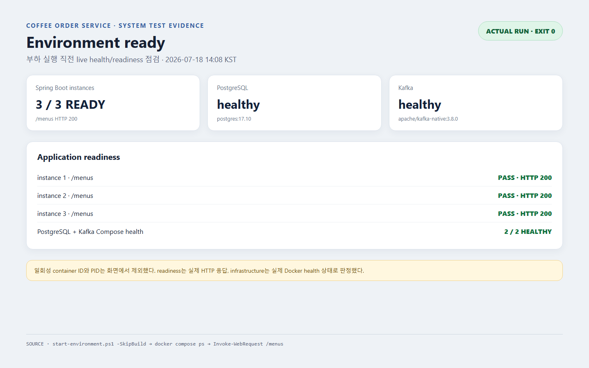
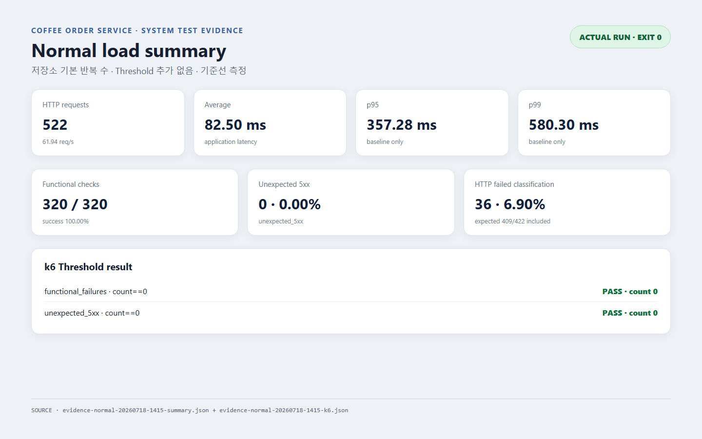
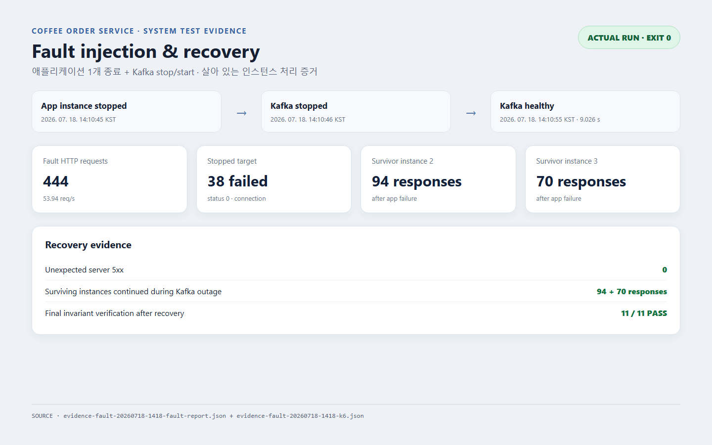
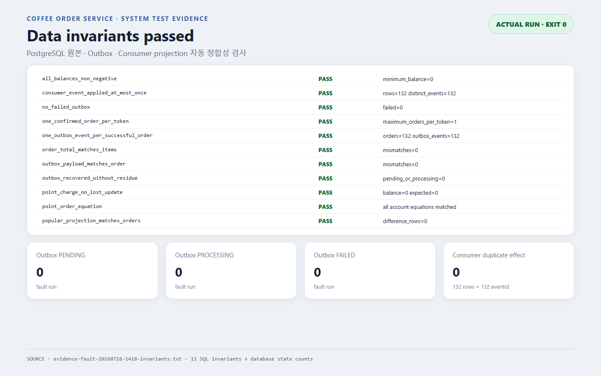

# 다중 인스턴스 시스템 검증 결과

## 실행 환경

- 2026-07-18, Windows 로컬 환경, Java 21, Docker Compose
- PostgreSQL 17.10 1개, Kafka 3.8.0 1개, Spring Boot 프로세스 3개
- Outbox: poll 200 ms, batch 20, lease 5초, retry backoff 250 ms~5초
- Kafka Consumer retry: 3회, 250 ms 시작, 2배 증가, 최대 2초
- 실행 commit: `0260816020805ab1c2450b6379658dbb2139b908`
- 전체 명령, 버전, 원본 파일과 hash: [`evidence-manifest.md`](evidence/system-test/2026-07-18/evidence-manifest.md)

## 기준선 실행

저장소 기본 설정인 `ChargeIterations=60`, `SpendIterations=80`, `IdempotentIterations=30`, `ConflictIterations=30`, `MixedIterations=120`으로 실행했다. 이 수치는 재현 가능한 로컬 기준선이며 성능 목표가 아니다.

- 총 HTTP 요청: 522
- 처리량: 61.94 req/s
- 평균 응답시간: 82.50 ms
- p95: 357.28 ms
- p99: 580.30 ms
- 기능 check: 320/320 성공
- 예상하지 않은 5xx: 0건
- k6 Threshold: 기존 2개 모두 통과
- 자동 정합성 검사: 11개 불변식 모두 통과
- 주문·Outbox·Consumer eventId: 각각 172건
- Outbox PENDING·PROCESSING·FAILED: 모두 0건

k6의 `http_req_failed` 36건(6.90%)은 시나리오가 정상 업무 결과로 허용한 409 6건과 422 30건이다. 예상하지 않은 오류율 0%와 분리한다.

## 장애 주입

부하 중 애플리케이션 한 인스턴스를 종료하고 Kafka를 5초간 의도적으로 중단한 뒤 container health까지 복구했다.

- 총 HTTP 요청: 444
- 처리량: 53.94 req/s
- 평균 응답시간: 55.80 ms
- p95: 252.53 ms
- p99: 406.28 ms
- 종료된 인스턴스 연결 실패: 38건
- 예상하지 않은 서버 5xx: 0건
- Kafka stop 요청부터 health 복구까지: 9.026초
- 살아 있는 인스턴스 응답: 각각 94건, 70건
- 주문·Outbox·Consumer eventId: 각각 132건
- 자동 정합성 검사: 11개 불변식 모두 통과
- 복구 후 PENDING·PROCESSING·FAILED Outbox: 모두 0건

연결 실패 38건은 별도 Load Balancer 없이 k6가 종료된 port까지 순환한 결과다. 살아 있는 두 인스턴스는 Kafka 중단 구간에도 요청을 계속 처리했지만, 이 수치만으로 서비스 수준의 장애 오류율이나 failover RTO를 판정할 수는 없다.

## 실행 증거

이 이미지는 PostgreSQL·Kafka health와 Spring Boot 인스턴스 3개의 `/menus` HTTP 200을 증명한다. `start-environment.ps1 -SkipBuild`, `docker compose ps`, `Invoke-WebRequest /menus` 결과이며 원본 연결 정보와 hash는 [`evidence-manifest.md`](evidence/system-test/2026-07-18/evidence-manifest.md)에 있다. 이 readiness와 health는 환경 준비 합격 기준이다.

이 이미지는 `run-normal-load.ps1`의 요청 수, 처리량, 기능 성공률, 오류 분류, 평균·p95·p99와 기존 k6 Threshold 통과를 보여준다. 원본은 `evidence-normal-20260718-1415-k6.json`, summary와 manifest이다. 기능 실패·예상 밖 5xx·Threshold는 합격 기준이며 처리량과 latency는 단순 기준선이다.

이 이미지는 `run-fault-injection.ps1`의 애플리케이션 종료, Kafka 중단·health 복구 시각, 9.026초의 하네스 복구시간과 생존 인스턴스의 계속된 응답을 보여준다. 원본은 fault report, `evidence-fault-20260718-1418-k6.json`과 manifest이다. 최종 복구와 계속된 처리는 합격 기준이지만 9.026초는 운영 RTO가 아닌 local 기준선이다.

이 이미지는 `verify-invariants.ps1`가 PostgreSQL 원본, Outbox와 Consumer projection을 대조한 11개 불변식 전체, 상태별 Outbox 잔류와 `eventId` 중복 업무 효과를 보여준다. 원본은 `evidence-fault-20260718-1418-invariants.txt`와 manifest이다. 모든 불변식 통과와 잔류·중복 효과 0건은 합격 기준이다.

스크린샷은 원본 결과를 읽기 쉽게 연결하는 시각 증거다. 성공 판정은 명령 종료 코드, k6 JSON, PostgreSQL 기준 데이터, Outbox, Consumer projection과 자동 불변식 결과가 모두 일치하는지로 결정했다.

## 결과로 확정 가능한 사항

- 정상·장애 실행의 11개 정합성 불변식이 모두 통과했다.
- 예상하지 않은 서버 5xx가 발생하지 않았다.
- 장애 복구 후 PENDING·PROCESSING·FAILED Outbox가 남지 않았다.
- 동일 `eventId`가 Consumer 업무 효과를 중복 발생시키지 않았다.
- Kafka health, Outbox drain과 Consumer projection이 최종 복구됐다.

## 아직 확정하지 않는 사항

- 목표 처리량
- p95·p99 SLO
- 허용 오류율
- 애플리케이션 failover RTO
- Kafka 운영 RTO
- Outbox lease와 batch의 운영 최적값
- PostgreSQL connection pool 최적값

이번 단일 로컬 실행값을 운영 SLO나 장기 Threshold로 승격하지 않는다. 목표값은 고정된 환경에서 부하 구간별 반복 측정, 중앙값과 변동 폭, 예상 사용자 규모와 여유 용량을 함께 비교한 뒤 결정한다.

## 해석과 남은 증거

이번 결과는 PostgreSQL·Kafka 단일 노드와 로컬 네트워크 기준선이다. Publisher별 선점 분포, 실행 중 Outbox 적체 변화, PostgreSQL connection 사용량, Consumer lag, Retry Topic·DLT 잔류는 자동 측정하지 않았다. Load Balancer와 재시도 정책이 없어 종료 인스턴스의 연결 실패는 관찰했지만 애플리케이션 failover RTO는 측정하지 않았다.
